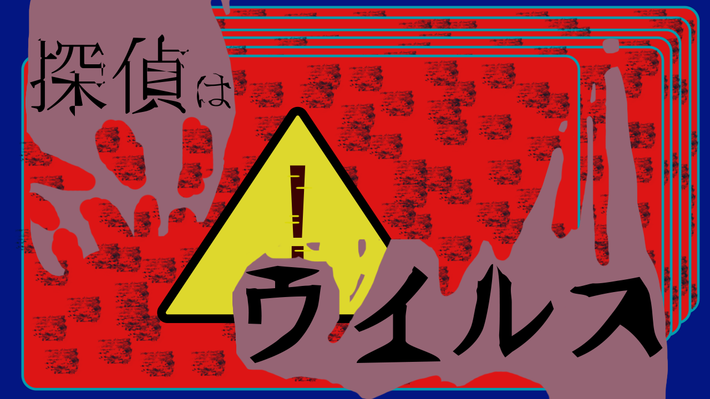
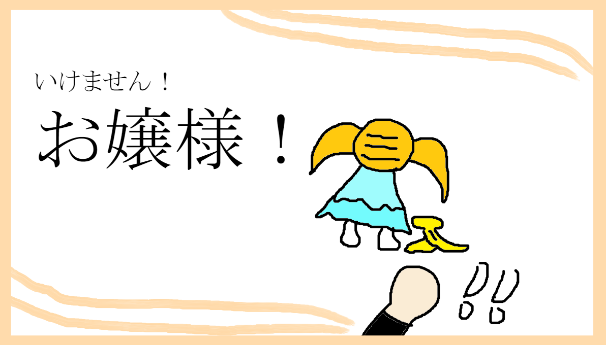
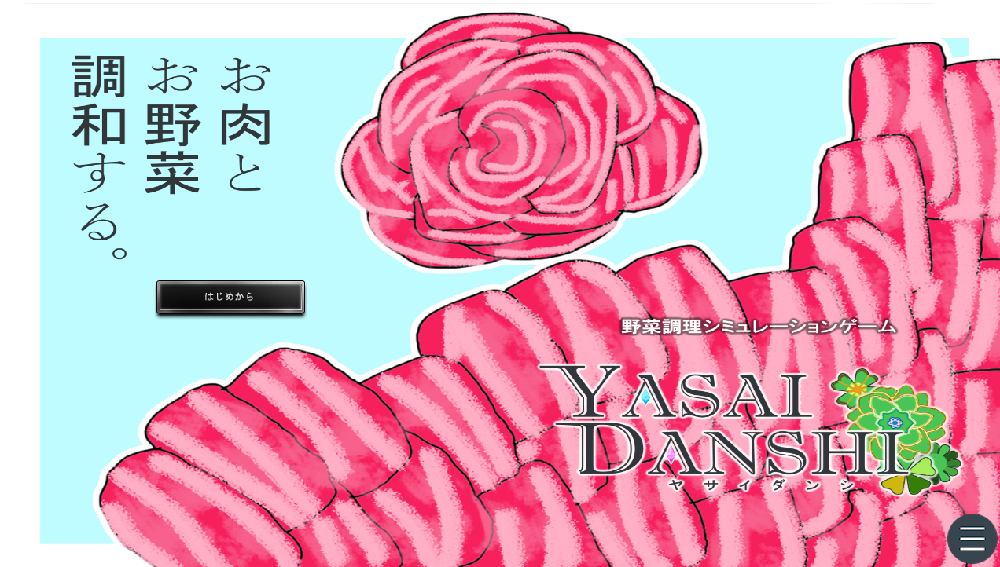
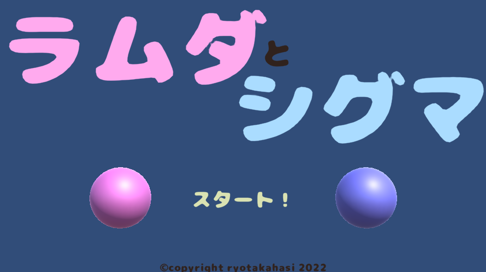

# portfolio

## 目次
- <自己紹介[https://github.com/ryotakahasi-dat22/portfolio/blob/main/README.md#%E8%87%AA%E5%B7%B1%E7%B4%B9%E4%BB%8B]>
- 資格
- スキル
- 取り組んているテーマ
- 作品リスト
 - 探偵はウイルス
 - いけません！お嬢様！
 - 野菜男子
 - シグマとラムダ
 - ピンポン2022
- 連絡先

## 自己紹介
- 高橋　涼
- 連絡先 Twitter [@ryotakahasi_gp](https://twitter.com/ryotakahasi_gp) / gmail ryotakahasi.dat22@gmail.com
- 専門学校デジタルアーツ東京 ゲームプログラムコース 2024年卒業予定

## 資格
- ビジネス文書実務検定試験
- 情報技術試験3級
- ビジネス能力検定3級

## スキル
- C#
  - 利用歴1年
  - Visual Studioで簡単なプログラムを使用可能
- Unity
  - 利用歴1年
  - オリジナルの個人開発経験あり
- C/C++
  - 利用歴1年
  - コンソールで簡単なデータ処理プログラムを開発
- java
  - 利用歴1ヵ月
  - 基礎知識を習得中

## 取り組んでいるテーマ
- 探偵はウイルスのグループ製作
- 個人での企画書作成
  - いけませんお嬢様を製作中
## 作品リスト

### 探偵はウイルス

うまく感染して事件を解決しよう！

- 開発環境：tyranoscrip
- 開発時期：2023/4/13～
- 開発期間：一ヶ月～（開発途中）
- 開発人数：三人
- 担　　当：ストーリー、プログラム、一部画面イラスト
- デジタルアーツ東京 卒業制作

### いけません！お嬢様！

お嬢様を学校まで無事に届けよう！

- 開発環境：Unity
- 開発時期：2023/3/23～
- 開発期間：二ヶ月～（開発途中）
- 開発人数：一人
- ゲームクリエイター甲子園２０２３ 参加作品

### 野菜男子

[野菜男子をプレイする方はこちらをクリック](https://novelgame.jp/games/show/7662)

マウスで自分の運命を決めよう！

相手の気持ちを考え適切な選択肢を選んでいこう。

- 開発環境：tyranoscrip
- 開発時期：2022/10/27-2022/11/10
- 開発期間：２週間
- 開発人数：一人
- デジタルアーツ東京DATフェスタ2022　提出作品

### シグマとラムダ

[シグマとラムダをプレイする方はこちらをクリック](https://unityroom.com/games/ramsigu)

[コードはこちらをクリック](https://github.com/ryotakahasi-dat22/u1wgj2212)

遠い宇宙を目指し、ハイスコアを更新して競い合おう！

下に落ちないよう二つの球を繰り返しクリックして上まで持っていこう！

- 開発環境：Unity
- 開発時期：2022/12/12-2022/12/18
- 開発期間：１週間
- 開発人数：一人
- 一週間ゲームジャム「Re」参加作品

### ピンポン2022

[コードと詳しい情報はこちらをクリック](https://github.com/ryotakahasi-dat22/pinnponn)

ボールを跳ね返して相手に勝とう！

- 開発環境：Windows10 + Visual Studio 2022 + Visual Studio 2019
- 開発時期：2022/8/1-2022/8/10
- 開発期間：十日
- 開発人数：一人
- デジタルアーツ東京夏課題　提出作品
- 初の自分で考えたゲーム製作

## 連絡先
- Twitter [@ryotakahasi_gp](https://twitter.com/ryotakahasi_gp)
- gmail ryotakahasi.dat22@gmail.com
