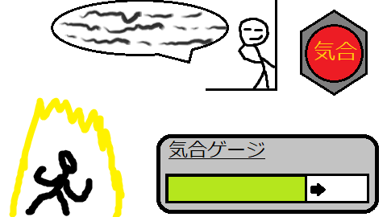

# portfolio

- 高橋　涼
- 連絡先 Twitter [@ryotakahasi_gp](https://twitter.com/ryotakahasi_gp) / gmail ryotakahasi.dat22@gmail.com
- 専門学校デジタルアーツ東京 ゲームプログラムコース 2024年卒業予定

## 資格
- ビジネス文書実務検定試験合格
- 情報技術試験3級合格
- ビジネス能力検定3級

## スキル
- C#
  - 利用歴1年
  - Visual Studioで簡単なプログラムを使用可能
- Unity
  - 利用歴1年
  - オリジナルの個人開発経験あり
- C/C++
  - 利用歴1年
  - コンソールで簡単なデータ処理プログラムを開発

## 取り組んでいるテーマ
- オリジナルゲーム開発
- オニギリジャンプのグループ製作
- 個人での企画書作成
  - アドベンチャーなどがおすすめとのこ
  - 甲子園2023の予定
## 作品リスト

### シグマとラムダ

[シグマとラムダ](https://unityroom.com/games/ramsigu)

遠い宇宙を目指し、ハイスコアを更新して競い合おう！

下に落ちないよう二つの球を繰り返しクリックして上まで持っていこう！

- 開発環境：Unity
- 開発期間：１週間
- 一週間ゲームジャム「Re」参加作品

### 野菜男子

マウスで自分の運命を決めよう！

相手の気持ちを考え適切な選択肢を選んでいこう。

- 開発環境：tyranoscrip
- 開発期間：２週間
- デジタルアーツ東京DATフェスタ2022　提出作品
- [ノベルコレクション](https://novelgame.jp/)審査中

### （仮）会話中は隙だらけ

相手が話に夢中になっている時にクリック連打で気合を貯めよう！

相手にばれるとゲームオーバーだ！

- 開発環境：Unity
- 開発期間：１週間
- ９月に開発中止
  - 一週間ゲームジャムの「ためる」に間に合わなかったため
  - この時点で主に演出とコードの納得いくものが作れなかったため

## 連絡先
- Twitter [@ryotakahasi_gp](https://twitter.com/ryotakahasi_gp)
- gmail ryotakahasi.dat22@gmail.com
