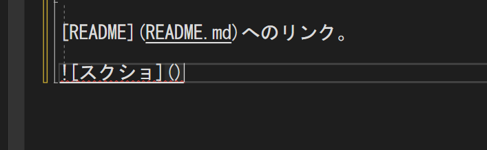

# 大見出し
## 中見出し
### 小見出し

普通の文字

**太字**

*斜体*

~~取り消し~~

X<sub>2</sub>

X<sup>2</sup>

以下抜粋

>ここに引用部分を書く

整数は`int`型がよい。

```cs

int a;

```

[README](README.md)へのリンク。



- 箇条書き
- 続き

1. 順番１
   - 下げ
1. 順番２
   1. a
   1. b
1. 順番３

- [ ] 作業１
- [x] 作業１
- [ ] 作業１


|No|氏名|フリガナ|
|-:|:-:|:-|
|1|田中|タナカ|